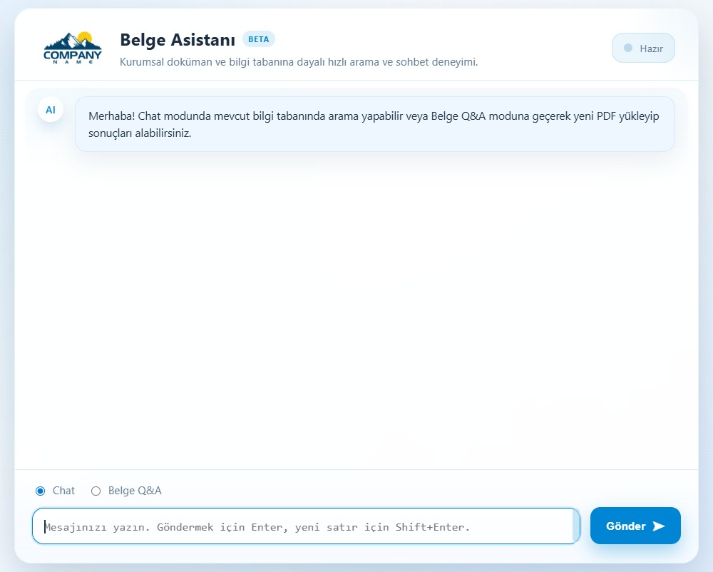

# Belge Asistanı

Belge Asistanı; PDF tabanlı kurum içi dokümanları Docling ile ayrıştıran, parçalayarak vektörleştiren ve Qdrant üzerinde indeksleyip Ollama destekli bir sohbet arayüzüne sunan hafif bir RAG (Retrieval-Augmented Generation) çözümüdür. Tek komutla PDF'ten arama sonuçlarına kadar tüm hattı çalıştırabilir veya FastAPI tabanlı web servisini devreye alarak kullanıcıların tarayıcı üzerinden belge yükleyip sorgu üretmesine olanak tanır.

## Logo
Arayüzde kullanılan logo `static/logo.jpg` dosyasından servis edilir; 190×38 px civarında yatay bir işaret beklenir. Farklı bir logo kullanmak için aynı yolu yeni görselle değiştirmeniz yeterli.

## Özellikler
- Docling + RapidOCR ile güvenilir PDF parse ve opsiyonel ImageMagick ön işleme
- Karakter tabanlı parçalara bölme, tekrar eden chunk'ları filtreleme
- Trendyol çok dilli embedding modeliyle GPU öncelikli vektör üretimi
- Qdrant koleksiyon yönetimi ve semantik arama
- Ollama tabanlı bağlamlı yanıt üretimi, Chat ve Belge Q&A modları
- CLI modunda PDF→chunk→Qdrant→arama hattını otomatikleştirme

## Depo Yapısı
| Yol | Açıklama |
| --- | --- |
| `document_understanding.py` | PDF işleme, chunk üretimi, embedding ve Qdrant entegrasyonunun tamamı bulunan tek dosya.
| `app.py` | FastAPI uygulaması, yükleme akışı ve sohbet endpoint'leri.
| `static/index.html` | Minimal ön yüz; sohbet arayüzü ve yükleme formu.
| `requirements.txt` | Python bağımlılıkları (Docling CLI, Qdrant istemcisi, Torch, vb.).

## Ekran Görüntüsü


## Hızlı Kurulum
1. Qdrant ve Ollama servislerini başlatın (örnek Qdrant komutu: `docker run -p 6333:6333 -p 6334:6334 qdrant/qdrant:latest`).
2. Ortamı hazırlayın:
   ```bash
   python -m venv .venv
   source .venv/bin/activate  # Windows için .venv\Scripts\activate
   pip install --upgrade pip
   pip install -r requirements.txt
   ```
3. API'yi ayağa kaldırın ve arayüzü açın:
   ```bash
   uvicorn app:app --host 0.0.0.0 --port 8000 --reload
   ```
   Ardından tarayıcıdan `http://localhost:8000/` adresine gidin.

## Konfigürasyon
`RagServiceConfig` sınıfı çevre değişkenleri üzerinden özelleştirilebilir. Sık kullanılan değişkenler:

| Değişken | Açıklama | Varsayılan |
| --- | --- | --- |
| `HR_RAG_COLLECTION` / `QDRANT_COLLECTION` | Varsayılan koleksiyon adı | `hr_rag` |
| `MODEL_DIR` | SentenceTransformer model önbelleği | HF cache |
| `QDRANT_URL` / `QDRANT_API_KEY` | Qdrant bağlantı bilgileri | `http://localhost:6333`, boş |
| `HR_RAG_THREADS`, `HR_RAG_DOCLING_BATCH` | Docling iş parçacığı ve batch sayısı | `4`, `2` |
| `HR_RAG_LANG` | OCR dili | `tr` |
| `HR_RAG_PREPROCESS`, `HR_RAG_PREPROCESS_PROFILE` | ImageMagick ön işleme kontrolü | `False`, `bw` |
| `HR_RAG_CHARS_MIN/MAX`, `HR_RAG_OVERLAP` | Chunk uzunluk parametreleri | `1200/1600`, `220` |
| `HR_RAG_EMBED_BATCH` | Embedding batch boyutu | `256` |
| `HR_RAG_TOP_K` | LLM'e gönderilecek sonuç sayısı | `3` |
| `HR_RAG_USE_OLLAMA`, `HR_RAG_OLLAMA_URL`, `HR_RAG_OLLAMA_MODEL` | LLM çağrı ayarları | `True`, `http://localhost:11434`, `aya-expanse:32b` |
| `HR_RAG_OLLAMA_TEMPERATURE` | Ollama sıcaklığı | `0.1` |
| `HR_RAG_OLLAMA_MAX_CONTEXT` | LLM bağlamına eklenecek chunk sayısı | `3` |

## Chat ve Belge Q&A Modları
- **Chat modu** varsayılan olarak yalnızca Ollama'ya bağlanır. Bir koleksiyon üzerinden arama yapmak istiyorsanız `HR_RAG_CHAT_USE_COLLECTION=1` olarak ayarlayın; uygulama bu durumda `HR_RAG_COLLECTION` (varsayılan `hr_rag`) değerindeki Qdrant koleksiyonuna bağlanır ve bulunan parçaları LLM bağlamı olarak kullanır. Bu yöntem, hazır bir bilgi tabanını sorgulamak için idealdir.
- **Belge Q&A modu** yüklediğiniz her PDF için `_collection_name_for_document` fonksiyonunun ürettiği ayrı bir koleksiyon açar. Koleksiyon adı PDF dosya adından türetilir, bu yüzden `AdSoyad-Birim.pdf` biçimi önemlidir. Dosya adı şu metaverileri sağlar:
  - `employee_name`: `AdSoyad` kısmı CamelCase bile olsa otomatik olarak boşluklandırılır.
  - `department`: Dosya adındaki ikinci kısım (`Birim`) alt çizgiler boşluğa çevrilerek saklanır.
  - `doc_title`: Tam dosya adı stem'i (ör. `AdSoyad-Birim`).
  Bu alanlar her chunk kaydına yazılır (ör. `chunk_id = {employee_name_slug}__p{sayfa}__c{indeks}`) ve sonuç listesinde gösterilir. `/api/run` yanıtındaki `[COLLECTION ...]` satırı en son oluşturulan koleksiyonu bildirir; `/api/doc_chat` otomatik olarak bu koleksiyonu kullanır.

## CLI ile Tam Hattı Çalıştırma
Web arayüzüne ihtiyaç duymadan tüm akışı tek komutla başlatabilirsiniz:
```bash
python document_understanding.py \
  --pdf data/PersonelDosyasi.pdf \
  --collection hr_rag \
  --qdrant-url http://localhost:6333 \
  --threads 4 \
  --batch 2 \
  --preprocess
```
Komut sırasıyla PDF'i (opsiyonel) ön işler, Docling çıktıları üretir, chunk dosyaları hazırlar, embedding'leri hesaplayıp Qdrant'a upsert eder ve `--query` sağlanmışsa sonuçları yazdırır. Parametrelerin tamamını `python document_understanding.py --help` ile görebilirsiniz.

## Çıktılar
- `*_docling/` altında Docling Markdown (`.md`), JSON (`.json`) ve yardımcı dosyalar.
- `chunks/` klasöründe chunk kayıtlarını içeren `chunks.jsonl` ve `chunks.csv` dosyaları.
- Loglarda ImageMagick ara klasörleri ve Qdrant koleksiyon isimleri.

## Lisans
MIT Lisansı. Ayrıntılar için `LICENSE` dosyasına bakın.
